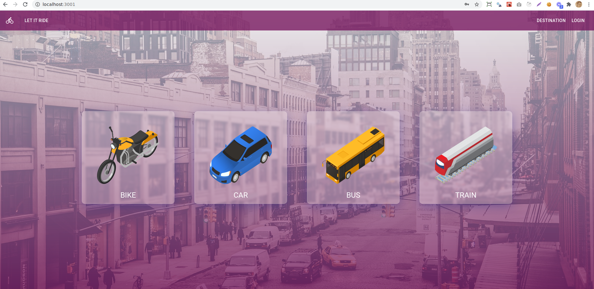

<div align="center">
  

# Let It Ride - Ride sharing service

A platform where you can share/take ride

<br/>


✨ _Loved the project? Give this project a star to show your support._ ✨


   
</div>

---

## 🧐 Feature list

- [x] explore favourite vehicle
- [x] login with email
- [x] social login (github, facebook, google)

## 🚀 Getting started

This project is deployed at https://ph-assignment-09.web.app/

Guide for local deployment -

1. Clone the repository

```bash
git@github.com:Porgramming-Hero-web-course/react-auth-ashiqdev.git
```

2. Install dependencies

```bash
yarn
```


3. Run app

```bash
yarn start
```

4. Open project at http://localhost:3000


## ❤️ Support

If you happen to love this project, leave a star on the repo. That'll keep me motivated. Let me know your thoughts with a tweet. Mention me [@ashikduit](https://twitter.com/ashikduit).

Thanks!

Contributions are welcomed!

<div align="center">
Developed with ❤️ in Bangladesh
</div>
